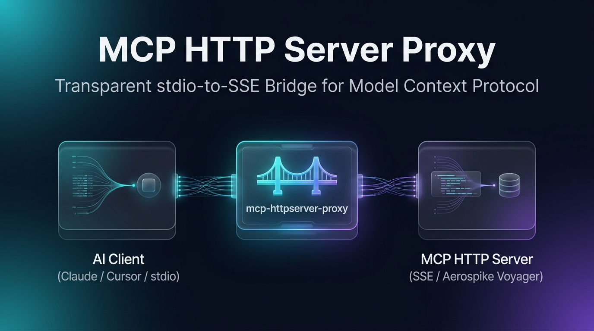

# MCP HTTP Server Proxy

<p align="center">
  <a href="https://github.com/shailesh17/mcp-httpserver-proxy/actions/workflows/ci.yml">
    
  </a>
  <a href="https://gitlab.com/shaileshpatel17/mcp-httpserver-proxy/-/pipelines">
    
  </a>
  <a href="https://claude.ai">
    
  </a>
  <a href="https://github.com/shailesh17/mcp-httpserver-proxy/blob/main/LICENSE">
    
  </a>
  <a href="https://nodejs.org">
    
  </a>
  <a href="https://pnpm.io">
    
  </a>
  <a href="https://www.conventionalcommits.org">
    
  </a>
</p>

<p align="center">
  
</p>

<p align="center">
  <a href="#-quick-start">Quick Start</a> •
  <a href="#-client-configuration-guides">Client Config</a> •
  <a href="#-ecosystem-comparison-client-adapter-vs-server-wrapper">Ecosystem Comparison</a> •
  <a href="#-cli-usage--options">CLI Options</a> •
  <a href="#-ai-native-development--agent-setup">AI Setup</a>
</p>

A lightweight, high-performance transparent proxy that bridges [Model Context Protocol (MCP)](https://modelcontextprotocol.io/) servers operating over HTTP with Server-Sent Events (SSE) to desktop and editor AI clients (such as [Claude Desktop](https://claude.ai/download) and [Cursor](https://www.cursor.com/)) communicating over standard input/output (`stdio`).

---

## 💡 Why This Proxy is Essential for Local Tools & Development

Desktop MCP clients (like [Claude Desktop](https://claude.ai/download) and [Cursor](https://www.cursor.com/)) are primarily built around spawning local subprocesses communicating via `stdio`. However, real-world development workflows and modern microservices frequently favor HTTP/SSE transports.

Here is why `mcp-httpserver-proxy` is a critical tool in your development workflow:

- **🔥 Seamless Hot-Reloading & Rapid Iteration**: When an MCP server is spawned as a raw `stdio` subprocess inside Claude Desktop, editing your tool code requires completely restarting Claude Desktop to reload the subprocess. With this proxy, you can run your MCP server as a standalone HTTP/SSE service with hot-reloading (e.g., [nodemon](https://nodemon.io/), [tsx watch](https://github.com/privatenumber/tsx), or [uvicorn --reload](https://www.uvicorn.org/)). You iterate instantly without interrupting your LLM session.
- **🌐 Shared Local & Containerized Backends**: Run a single local or containerized MCP server (e.g., in [Docker](https://www.docker.com/), Kubernetes, or [DevContainers](https://containers.dev/)) hosting database inspectors, filesystem tools, or custom APIs, and bridge it simultaneously to multiple client instances or editors.
- **🚀 Cross-Language Ecosystems**: Build MCP servers in any language or web framework ([Python/FastAPI](https://fastapi.tiangolo.com/), Go, Rust, C#, Java, Node/Express) and connect them effortlessly to desktop clients without dealing with OS-level subprocess spawn quirks.
- **☁️ Remote & Networked Environments**: Connect your local Claude Desktop to MCP servers running on remote dev boxes, cloud instances, or internal networks over an HTTP/SSE endpoint.

---

## 🎯 Real-World Use Cases & Scenarios

Here are common real-world scenarios where `mcp-httpserver-proxy` is actively used:

### 1. 🗄️ Database & Search Server Integrations (e.g. Aerospike Voyager)

- **The Challenge**: Production-grade database connectors, vector databases, and semantic search systems (like [Aerospike Voyager](https://github.com/aerospike/voyager)) expose HTTP/SSE endpoints because they manage internal state, connection pools, and real-time streaming subscriptions across multiple queries.
- **The Solution**: Use `mcp-httpserver-proxy` to connect Claude Desktop to your running Aerospike Voyager instance without installing specialized local database binaries or drivers in your desktop client.

### 2. 🐳 Docker Containers & DevContainers

- **The Challenge**: Your MCP tools and dependencies (e.g., database clients, Python libraries, system binaries) are containerized inside [Docker](https://www.docker.com/), WSL2, or a [DevContainer](https://containers.dev/) where direct `stdio` process spawning from the host desktop OS is cumbersome.
- **The Solution**: Expose the container's HTTP/SSE port (e.g., `http://localhost:3000/sse`) to your host and connect Claude Desktop with `npx mcp-httpserver-proxy http://localhost:3000/sse`.

### 3. ⚡ Live Tool Authoring & Hot-Reloading

- **The Challenge**: Developing new MCP tools with `stdio` requires constantly quitting and restarting Claude Desktop to test every minor code adjustment.
- **The Solution**: Develop your MCP server using standard HTTP frameworks with live-reloading (`uvicorn app:app --reload` in Python or `tsx watch server.ts` in TypeScript). The proxy preserves the active stdio session while your server updates live.

### 4. 🏢 Centralized Enterprise & Team Tool Backends

- **The Challenge**: An engineering organization provides shared developer tools (e.g., Kubernetes cluster inspectors, internal service catalogs, Jira/GitLab orchestrators) hosted on an internal network or dev cluster.
- **The Solution**: Developers connect their local Claude Desktop or Cursor directly to the internal endpoint via `npx mcp-httpserver-proxy https://mcp.internal.corp/sse` with zero local dependency installation.

---

## 🏗️ Architecture & How It Works

```text
┌───────────────────────────────┐
│     Desktop / IDE Client      │
│   (Claude Desktop, Cursor)    │
└──────────────┬────────────────┘
               │  JSON-RPC via stdio (stdin/stdout)
               ▼
┌───────────────────────────────┐
│     mcp-httpserver-proxy      │
│  - StdioServerTransport       │
│  - SSEClientTransport         │
└──────────────┬────────────────┘
               │  HTTP / Server-Sent Events (SSE)
               ▼
┌───────────────────────────────┐
│     Target MCP Server         │
│  (FastAPI, Express, Go, etc.) │
└───────────────────────────────┘
```

1. **Proxy exposes a `stdio` interface** to Claude Desktop or Cursor, acting as a local command.
2. **Proxy connects as an SSE client** to your target HTTP MCP server.
3. **Transparent bi-directional forwarding**: JSON-RPC requests, notifications, and responses are forwarded in real time.
4. **Lifecycle Coordination**: Guarantees the SSE backend connection is established before initiating the stdio handshake, preventing dropped initialization frames.
5. **Stdio Stream Hygiene**: All diagnostics and error messages are isolated to `stderr`, keeping `stdout` strictly dedicated to JSON-RPC protocol frames.

---

## 🧭 Ecosystem Comparison: Client Adapter vs Server Wrapper

When exploring Model Context Protocol (MCP) proxy tools, developers often encounter different tools with similar names. MCP proxies generally fall into two distinct, complementary architectural categories:

```text
Pattern A: Client-Side Adapter (This Project: mcp-httpserver-proxy)
┌────────────────┐     stdio      ┌──────────────────────┐      SSE/HTTP      ┌────────────────┐
│ Claude/Cursor  │ ─────────────► │ mcp-httpserver-proxy │ ─────────────────► │ Remote MCP     │
│ (Desktop App)  │                │ (Client Bridge)      │                    │ (HTTP Server)  │
└────────────────┘                └──────────────────────┘                    └────────────────┘

Pattern B: Server-Side Wrapper (e.g. mcp-proxy, supergateway)
┌────────────────┐    SSE/HTTP    ┌──────────────────────┐       stdio        ┌────────────────┐
│ Web Client /   │ ─────────────► │      mcp-proxy       │ ─────────────────► │ Local Stdio    │
│ Remote Service │                │ (Server-side Daemon) │                    │ MCP Tool CLI   │
└────────────────┘                └──────────────────────┘                    └────────────────┘
```

### 📊 Architectural Comparison Matrix

| Dimension                | `mcp-httpserver-proxy` (This Project)                                                                                                 | Server-Side Wrappers (e.g., `mcp-proxy`, `supergateway`)                                                            |
| :----------------------- | :------------------------------------------------------------------------------------------------------------------------------------ | :------------------------------------------------------------------------------------------------------------------ |
| **Architectural Role**   | **Client-Side Adapter** (`stdio → SSE`)                                                                                               | **Server-Side Wrapper** (`SSE/HTTP → stdio`)                                                                        |
| **Execution Location**   | Runs locally on the developer's desktop machine                                                                                       | Runs on a remote server or container host                                                                           |
| **Client Transport**     | Local `stdio` (stdin/stdout)                                                                                                          | Network HTTP / Server-Sent Events (SSE)                                                                             |
| **Backend Transport**    | Network HTTP / Server-Sent Events (SSE)                                                                                               | Local `stdio` child process                                                                                         |
| **Primary Use Case**     | Connect desktop apps (Claude Desktop, Cursor) to existing remote HTTP/SSE servers (Aerospike Voyager, remote APIs, cloud containers). | Expose a legacy local CLI tool (`@modelcontextprotocol/server-postgres`) as an HTTP/SSE web service over a network. |
| **Client Compatibility** | Claude Desktop, Cursor, Cline, Roo Code, Gemini IDE                                                                                   | Web browsers, curl, HTTP clients, remote agents                                                                     |
| **Custom Auth Headers**  | ✅ Supported (`-H "Authorization: Bearer ..."`, `MCP_PROXY_HEADERS`)                                                                  | ❌ N/A (serves HTTP requests)                                                                                       |
| **Connection Retries**   | ✅ Supported with exponential backoff (`--retries`, `--retry-delay`)                                                                  | ❌ N/A (waits for incoming connections)                                                                             |

### 💡 Which tool should you use?

- **Use `mcp-httpserver-proxy`** if you have an MCP server already running as an **HTTP/SSE service** (locally, in Docker, or on a remote server) and you want your **desktop AI client** (Claude Desktop, Cursor) to connect to it.
- **Use a Server-Side Wrapper** if you have a **stdio-only CLI tool** (like an npm package or Python script) that you want to host on a server and expose to the web as an HTTP API.

---

## ⚡ Quick Start

You can run the proxy directly using `npx` (or `pnpm dlx`) without cloning or manually building the repository:

```bash
npx mcp-httpserver-proxy http://localhost:8080/sse
```

---

## ⚙️ Client Configuration Guides

### 1. Claude Desktop

Add the proxy to your `claude_desktop_config.json`:

- **macOS**: `~/Library/Application Support/Claude/claude_desktop_config.json`
- **Windows**: `%APPDATA%\Claude\claude_desktop_config.json`
- **Linux**: `~/.config/Claude/claude_desktop_config.json`

```json
{
  "mcpServers": {
    "my-http-mcp-server": {
      "command": "npx",
      "args": ["-y", "mcp-httpserver-proxy", "http://localhost:8080/sse"]
    }
  }
}
```

> **Local Build Alternative**: If running from a local clone, provide the absolute path to `dist/index.js`:
>
> ```json
> {
>   "mcpServers": {
>     "my-http-mcp-server": {
>       "command": "node",
>       "args": [
>         "/absolute/path/to/mcp-httpserver-proxy/dist/index.js",
>         "http://localhost:8080/sse"
>       ]
>     }
>   }
> }
> ```

### 2. Cursor IDE

In [Cursor](https://www.cursor.com/), configure your MCP server settings in `~/.cursor/mcp.json` or your project's `.cursor/mcp.json`:

```json
{
  "mcpServers": {
    "my-http-mcp-server": {
      "command": "npx",
      "args": [
        "-y",
        "mcp-httpserver-proxy",
        "https://mcp.internal.corp/sse",
        "-H",
        "Authorization: Bearer my-secret-token",
        "-H",
        "X-Tenant-ID: acme"
      ]
    }
  }
}
```

> **Using Environment Variables**: You can also use `MCP_PROXY_HEADERS` to pass sensitive headers without exposing tokens in process argument lists:
>
> ```json
> {
>   "mcpServers": {
>     "my-http-mcp-server": {
>       "command": "npx",
>       "args": ["-y", "mcp-httpserver-proxy", "https://mcp.internal.corp/sse"],
>       "env": {
>         "MCP_PROXY_HEADERS": "{\"Authorization\": \"Bearer my-secret-token\"}"
>       }
>     }
>   }
> }
> ```

---

## 💻 CLI Usage & Options

```text
Usage: mcp-httpserver-proxy <mcp-server-sse-url> [options]

Options:
  -H, --header <name: value>   Custom HTTP request header (can be repeated)
  -r, --retries <count>        Number of connection attempts on startup (default: 3)
  -d, --retry-delay <ms>       Base retry delay in milliseconds (default: 1000)
  -h, --help                   Show help information
  -v, --version                Show version number

Environment Variables:
  MCP_PROXY_HEADERS            JSON string of key-value header pairs
                               Example: '{"Authorization": "Bearer secret"}'
  MCP_PROXY_RETRIES            Number of connection attempts (default: 3)
  MCP_PROXY_RETRY_DELAY        Base retry delay in milliseconds (default: 1000)

Examples:
  # Basic connection
  mcp-httpserver-proxy http://localhost:8080/sse

  # With authentication headers
  mcp-httpserver-proxy https://api.example.com/sse -H "Authorization: Bearer secret"

  # Multiple headers
  mcp-httpserver-proxy https://api.example.com/sse -H "X-Api-Key: 123" -H "X-Tenant-ID: acme"

  # Resilient retries for delayed backend startup / Docker containers
  mcp-httpserver-proxy http://localhost:8080/sse --retries 5 --retry-delay 2000
```

---

## 🤖 AI-Native Development & Agent Setup

This repository is built and maintained as a **100% AI-native development model**. Developers and contributors are encouraged to use AI coding agents ([Antigravity](https://github.com/shailesh17/mcp-httpserver-proxy), [Cursor](https://www.cursor.com/), [Claude Code](https://claude.ai/), [GitHub Copilot](https://github.com/features/copilot), [Gemini CLI](https://ai.google.dev/)) to implement features, run tests, and open Pull Requests.

### 📚 Agent Configuration Files

| File                                                                             | Purpose                                                       | Target Agent / Tool       |
| :------------------------------------------------------------------------------- | :------------------------------------------------------------ | :------------------------ |
| **[CLAUDE.md](./CLAUDE.md)**                                                     | Claude Code session instructions, task commands, and rules    | Anthropic Claude Code CLI |
| **[AGENTS.md](./AGENTS.md)**                                                     | Core architectural constraints, stdout rules, and PR workflow | All AI Coding Assistants  |
| **[GEMINI.md](./GEMINI.md)**                                                     | Antigravity / Gemini IDE workspace instructions               | Antigravity, Gemini CLI   |
| **[.github/copilot-instructions.md](./.github/copilot-instructions.md)**         | IDE coding instructions                                       | GitHub Copilot, Cursor    |
| **[.agents/skills/create-pr/](./.agents/skills/create-pr/SKILL.md)**             | Automated PR creation runbook & rich Markdown generator       | Antigravity, AI Subagents |
| **[.agents/skills/mock-sse-server/](./.agents/skills/mock-sse-server/SKILL.md)** | Mock SSE MCP server for local end-to-end testing              | Antigravity, AI Subagents |

### 🛠️ Essential Command Flow for Developers & Agents

```bash
# 1. Setup environment & Git hooks
pnpm install

# 2. Compile TypeScript
pnpm run build

# 3. Format code (Prettier via Trunk)
pnpm run format

# 4. Lint & static analysis (Trunk check)
pnpm run check

# 5. Start mock SSE server for verification
node .agents/skills/mock-sse-server/scripts/mock-server.js

# 6. Test proxy against mock SSE server
node dist/index.js http://127.0.0.1:8123/sse
```

### 💬 Ready-to-Use Agent Prompt

Copy and paste this prompt to instruct your AI assistant:

```text
Please implement [feature/fix description].
1. Follow the guidelines in AGENTS.md (especially stdout stream hygiene).
2. Verify with `pnpm run build`, `pnpm run format`, and `pnpm run check`.
3. Test against the mock SSE server in `.agents/skills/mock-sse-server`.
4. Open a Pull Request using the workflow in `.agents/skills/create-pr/SKILL.md`.
```

---

## 🛠️ Local Development & Contributing

For full guidelines on our single-trunk branching model, Conventional Commits standard, and automated PR verification, see [CONTRIBUTING.md](./CONTRIBUTING.md).

---

## 🔍 Troubleshooting & FAQ

### Connection Refused / Backend Server Down

- Ensure your HTTP MCP server is up and listening on the specified URL before starting the client.
- Test the SSE endpoint in your terminal:

  ```bash
  curl -N http://localhost:8080/sse
  ```

### Inspecting Diagnostic Logs

- All proxy internal logs and error traces are routed to `stderr`.
- Claude Desktop stderr logs can be inspected at:
  - **macOS**: `tail -f ~/Library/Logs/Claude/mcp*.log`
  - **Windows**: `type %APPDATA%\Claude\logs\mcp*.log`

---

## 📄 License

This project is licensed under the [MIT License](./LICENSE).
